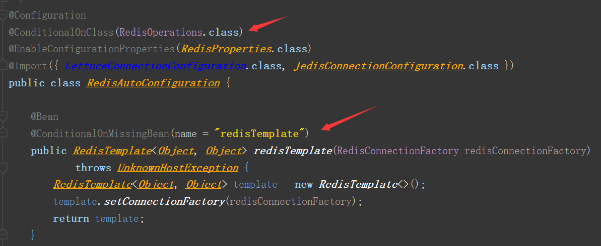

#### springboot-cache使用细则

#### 1. 引入pom依赖

   ```xml
   <dependency>
       <groupId>org.springframework.boot</groupId>
       <artifactId>spring-boot-starter-cache</artifactId>
   </dependency>
   ```

#### 2. 开启缓存

   ```java
   @SpringBootApplication
   @EnableCaching //启用缓存
   public class SpringbootCacheApplication {
       public static void main(String[] args) {
           SpringApplication.run(SpringbootCacheApplication.class, args);
       }
   }
   ```

#### 3. 自动配置原理

1. 引入缓存配置选择器


​	导入所有的cache自动配置组件,根据条件判断具体生效的组件

 

**默认启用SimpleCacheConfiguration类**

   2. 注入SimpleCacheManager组件

       ```java
       	@Bean
       	public ConcurrentMapCacheManager cacheManager() {
       		ConcurrentMapCacheManager cacheManager = new ConcurrentMapCacheManager();
       		List<String> cacheNames = this.cacheProperties.getCacheNames();
       		if (!cacheNames.isEmpty()) {
       			cacheManager.setCacheNames(cacheNames);
       		}
       		return this.customizerInvoker.customize(cacheManager);
       	}
       ```

   3. CacheManager/Cache/entity区分

      一个springboot应用有多个CacheMannger(缓存管理器),一个缓存管理器中有一个CacheMap,中间存储键值对.	

#### 4.添加/更新/删除缓存

1. 添加缓存

   ```java
       @Cacheable(cacheNames = "empl")  //将方法返回结果作为缓存
       public Employee queryEmployeeById(Integer id) {
           Employee employee = employeeMapper.queryEmployeeById(id);
           System.out.println("执行了一次查询 职员id为"+id);
           return employee;
       }
   ```

   ​	cache组件生成原理:

   ```java
   public Cache getCache(String name) {   // 根据CacheName获取对应的cacheManager
       Cache cache = this.cacheMap.get(name);
       if (cache == null && this.dynamic) { 
           synchronized (this.cacheMap) {
               cache = this.cacheMap.get(name);
               if (cache == null) {      //如果没有cacheManager,创建并加入cacheMap
                   cache = createConcurrentMapCache(name);
                   this.cacheMap.put(name, cache);
               }
           }
       }
       return cache;
   }
   ```

   ​	这时我们就自主的创建了一个叫`empl`的cache组件,我们开始根据生成的key在cache组件中判断是否存在值? 默认根据参数来生成key

  2. 更新缓存

```java
         @CachePut(key = "#id" ,cacheNames = {"empl"})
         public Employee updateEmployeeName(String name,Integer id){
             ------
             return employeeMapper.queryEmployeeById(id);
         }
```

 	将返回的值作为value,通过key缓存到store中

3. 删除缓存()

   ```java
    @CacheEvict(cacheNames = "empl",keyGenerator = "myKeyGenerator",allEntries = true,beforeInvocation = true) 
   public boolean deleteEmployee(Integer id){
       System.out.println("删除职员"+id);
       return true;
   }
   ```

   allEntries				  一次性清除所有缓存

   beforeInvocation    在方法执行之前,就清除缓存.	

4. keyConfig的使用

```java
 @Bean(name = "myKeyGenerator")
 public KeyGenerator keyGenerator(){
     return ( target,  method,  params)->{
         String s = params[0]+"";
         s= "["+s+"]";
         System.out.println("生成的key值为"+s);
         return s;
     };
 }
```

​	 注册一个自定义的key生成器

```java
  @Cacheable(cacheNames = "empl",keyGenerator = "myKeyGenerator")  
     public Employee queryEmployeeById(Integer id) {
       	...
         return employee;
     }
```

​	引入keyGenerater,注意**key与keyGenerater二选一**

5. @caching&@CacheConfig

   ```java
    @Caching(cacheable = {@Cacheable(keyGenerator = "myKeyGenerator",cacheNames = "empl")},
          put = {
               @CachePut(cacheNames ="empl",key = "#result.id"),
               @CachePut(cacheNames ="empl",key = "#result.email")
          }
    )
   
   	代码表示 首先@cacheable在方法之前执行,使用myKeyGenerator生成的key与employee对象映射存储到store中,@cacheput在方法之后执行,再将employee.id&employee.email对应employee存储到store中.
   ```
   
```java
   @CacheConfig(cacheNames = "empl" )
   cacheconfig 统一抽取公共部分
```

#### 5. springboot集成redis

​	引入pom依赖

```java
        <dependency>
            <groupId>org.springframework.boot</groupId>
            <artifactId>spring-boot-starter-data-redis</artifactId>
        </dependency>
```

​	配置redis的地址(这里redis使用的是docker部署)

```java
  	redis:
        host: 192.168.100.128
        port: 6379
```

-----------------------------

redis存储五大类型数据

```sh
#String: 字符串
redis01:0>set 1 wang
"OK"

redis01:0>get 1
"wang"

redis01:0>append 1 jun
"7"

redis01:0>get 1
"wangjun"

redis01:0>del 1
"1"
-------------------------------
#Hash: 散列
redis01:0>hset hash 1 wang
"1"

redis01:0>hset hash 2 junkang
"1"

redis01:0>hmget hash 1
 "wang"
 
redis01:0>hdel hash 1
"1"

redis01:0>hmget hash 1
 null
 ---------------------------------
#List: 列表
redis01:0>rpush list a
"1"

redis01:0>rpop list 

注意list可以分左右插入数据
------------------------------------
#Set: 集合
redis01:0>sadd a 1
"1"

redis01:0>sadd a 2
"1"

redis01:0>spop a 1
"3"
#Sorted Set: 有序集合

-----
```

**使用springboot-cache来操作redis**

```java
# 获取字符串操作对象 
ValueOperations<String, String> ssvo = stringRedisTemplate.opsForValue();
#放入值
ssvo.set("name","wang");
#根据键查询出的值追加value
ssvo.append("name","junkang");
#取出值
String name = ssvo.get("name");
System.out.println("name = " + name);
```

-------------------------------

```java
# 获取hash表的操作对象
HashOperations<String, Object, Object> stringObjectObjectHashOperations = stringRedisTemplate.opsForHash();
#放入hash的kv
stringObjectObjectHashOperations.put("hash",1+"","wang");
#根据key取出hash
Object hash = stringObjectObjectHashOperations.get("hash", 1+"");
System.out.println("hash = " + hash);
```

**注意StringRedisTemplate只能操作String对象 =>RedisTemplate<String, String>**

----------------

上述的操作都是基于封装后的StringredisTemplate,即操作的都是键值都是String类型的,如下,当需要操作实体对象时,就必须使用RedisTemplate.

原因: redis-starter 默认采用 jdk序列化来存储键值对的,Key/Value对应的序列化数据存入了redis中

平常我们更愿意使用json来显示数据格式,于是我们可以对配置一个自定义的Bean

```java
@Bean(name = "redisTemplate")
public RedisTemplate<Object,Employee> redisTemplate(RedisConnectionFactory redisConnectionFactory){
    RedisTemplate<Object, Employee> redisTemplate = new RedisTemplate<>();
    redisTemplate.setConnectionFactory(redisConnectionFactory);
    redisTemplate.setDefaultSerializer(new Jackson2JsonRedisSerializer<>(Employee.class));
    return redisTemplate;
}
```

​	从上面可以看出 我们自定义了一个Object对应Employee的模板,使用的序列化器是Jackson2JsonRedisSerializer,它可以将对象转为json数据,并存入redis中.


------------------

redis-starter的自动化配置原理



此时原先的SimpleCache自动配置就失效了,转而RedisCacheConfiguration生效.


-----------------------------

使用CacheManager进行源码操作:


#### 