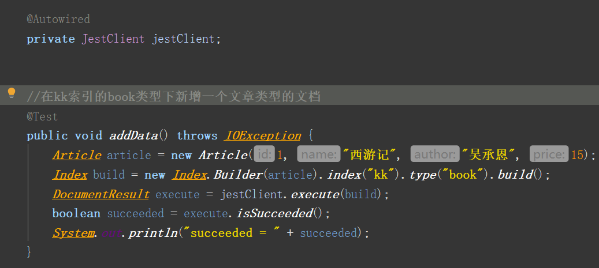

#### ElasticSearch 使用方式

1. 文档的组成,元数据

   平常所说的对象就是ES中文档

2. restful风格的crud文档

   get做查询,put做更新/添加操作,delete做删除操作

3. 乐观的并发控制

   通过version做版本控制,每次更新,value值自增1.


#### 安装

​	最简单的方式就是通过docker安装,使用docker命令`docker pull containerid`,将容器下载,接着启动命令

```cmd
docker run -d --name es -p 9200:9200 -p 9300:9300 docker.elastic.co/elasticsearch/elasticsearch:版本
```

最后运行`docker run `命令

注意 特别要注意 docker默认虚拟内存为1g,而ElasticSearch可能需要2g内存,因此需要修改运行命令.同样我们可以通过`docker logs  -f  containerId`查看日志报错信息

如果希望与kibana集成,可以使用docker镜像 elasticsearch.kibana集成后的镜像


#### 使用javaAPI来操作数据库

​	springboot默认支持2种技术与es交互,jest和springdata-es.

----------------

##### 1. jest操作ES

   

   

   **导入依赖**

   ```pom
   		<dependency>
   			<groupId>io.searchbox</groupId>
   			<artifactId>jest</artifactId>
   			<version>6.3.1</version>
   		</dependency>
   版本与es版本对应
   ```

   **配置参数**

   ```xml
   spring.elasticsearch.jest.uris=http://192.168.100.128:9200
   注意jedis默认与9200端口交互且使用的是http协议
   ```

   **使用步骤**

   

   

   注意 Es在存储文档(对象),默认会为该文档生成一个重合率很低的id,但如果我们希望拥有自己的主键id时,就可以在属性上加上`@JestId`注解,这时就不会生成id,转而采用文档的内部属性id赋值给_id作为标识

   

---------

##### 2.springboot-elasticsearch 操作ES

**导入pom文件**
    

```java
		<dependency>
			<groupId>org.springframework.boot</groupId>
			<artifactId>spring-boot-starter-data-elasticsearch</artifactId>
		</dependency>
```

**引入配置**

```java
spring.data.elasticsearch.cluster-name=docker-cluster
通过主机名+9200,查看cluster-name属性
spring.data.elasticsearch.cluster-nodes=192.168.100.128:9300
注意springboot-data 与es不是通过http交互,选用9300端口
```


    
**实现Respository接口** (以User类为例)
    

* 创建User类

  

  *在实体类上标注索引及类型*

* 创建接口继承ElasticsearchRepository

  

* 注入上面的接口,注入组件

  

  ----------------

  实际上,此时的UserRepository就已经具备了基本的crud功能,同样也可以实现自定义的功能

  

  输入方法名时,会有代码自动提示,判断具体功能的实现.

  ​	