#### 1. RabbitMQ核心概念
   * Message 消息,由消息头和消息体组成,消息头中存储发送的可选属性
   * Pushisher 生产者,向交换器发布信息
   * Exchange 接受生产者信息,并根据规则将消息路由到各自队列中
   * Queue 消息队列,消息的容器等待连接的消费者取走消息
   * Binding 绑定交换器与队列之间的关系(多对多的关系)
   * connection 网络连接 如tcp连接
   * Channel 信道,一条tcp连接中有多个信道,起到减少资源消耗
   * Consumer 消费者
   * visual host: 虚拟主机
   * broker: message 消息代理

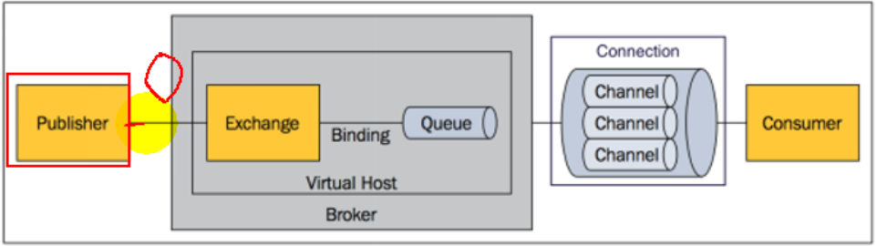


#### 2.RabbitMQ的运行机制

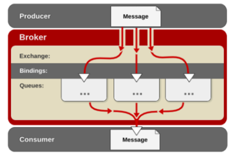

1. constomer生产消息 发到给broker
2. broker收到消息,给到合适的交换器
3. 交换机根据传过来的消息头的路由键转发到队列


#### 3. Exchange路由模式

* direct 直连模式

  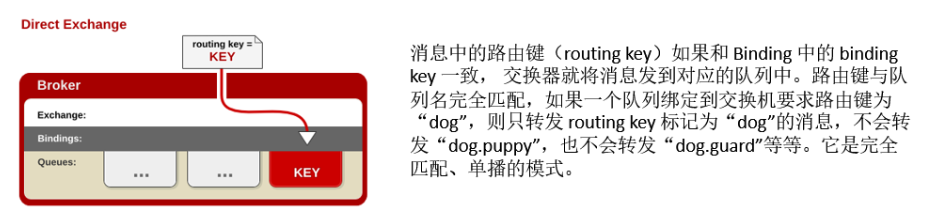

* fanout 广播模式

  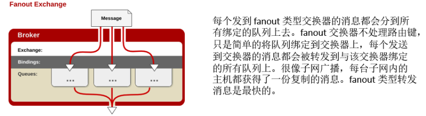

* topic 根据消息头进行模糊匹配,再路由

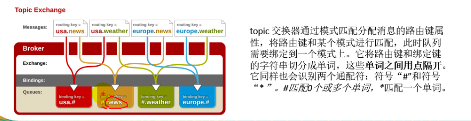

#### 4.RabbitMQ安装

安装RabbitMq,使用docker命令安装

1. 在dockerhub上进行search搜索activeMq,选择带有manager的镜像(具备web监控功能)

2. 主机上运行docker push XXXX  将远程镜像下载

3. 使用docker images 查看下载是否成功

   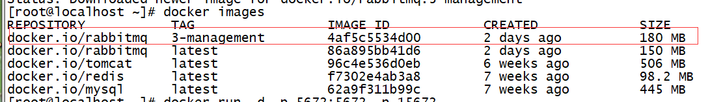

4. 运行 docker 

   ```shell
    docker run -d -p 5672:5672 -p 15672:15672 --name myrabbitMq 4af5c5534d00 
    默认选择5672作为消息端口,15672作为web监控
   ```

#### 5.RabbitMQ配置

* 交换机配置

  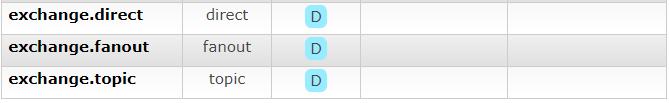

* 消息队列配置

  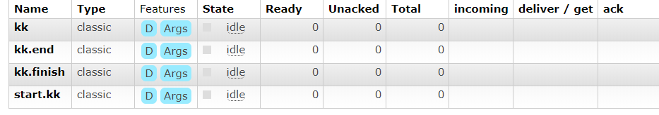

* 绑定

  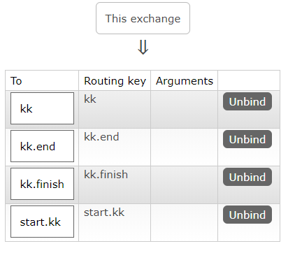

* 测试发送(省去)

  * direct 精准匹配消息队列
  * fanout 广播所有绑定了自己交换机的消息对列\
  * topic 模糊匹配 

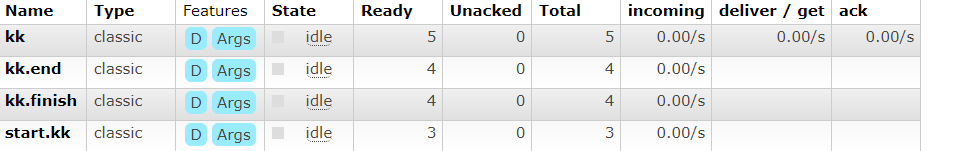


#### 6.springboot集成RabbitMQ

1. 导入pom依赖

2. 配置mq的地址及端口号

   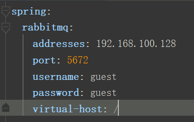

   3.接受/发送

   ```java
   #单播
       public void sendMessageByDirect() {
           HashMap<String, Object> map = new HashMap<>();
           Book book = new Book();
           book.setAuthor("于谦");
           book.setName("玩儿");
           map.put("book",book);
           rabbitTemplate.convertAndSend("exchange.direct","kk",map);
       }
   
       public void getMessage() {
           Object kk = rabbitTemplate.receiveAndConvert("kk");
           System.out.println("kk = " + kk.getClass());
           System.out.println("kk = " + kk);
       }
   #广播
       public void sendMessageByFanout() {
        Book book = new Book();
           book.setAuthor("兰陵笑笑生");
        book.setName("金瓶梅");
           rabbitTemplate.convertAndSend("exchange.fanout","",book);
    }
   
   
   ```
   
   **springboot-mq默认采用的是jdk序列化的操作,可以替换MessageConver组件,选择Jackson组件使生成json串来传输信息**
   
   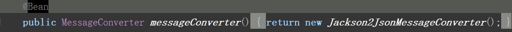
   
   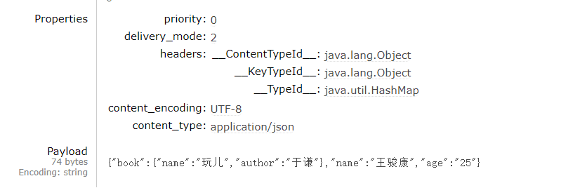
   
   4. 使用amqpAdmin操作RabbitMQ
   
      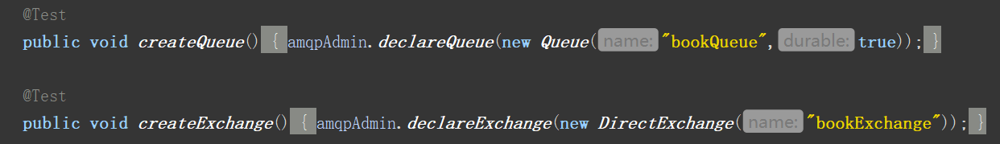
   
      ​	创建交换器时,默认持久化和非自动删除
   
      
   
      
   
      ----------------
   
      绑定交换机与消息队列
   
      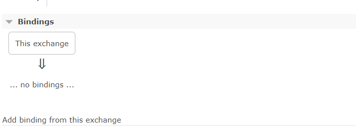
   
      ```java
      amqpAdmin.declareBinding(newBinding("bookQueue",Binding.DestinationType.QUEUE,"bookExchange","book",null));
      
      ```
   
      绑定后
   
      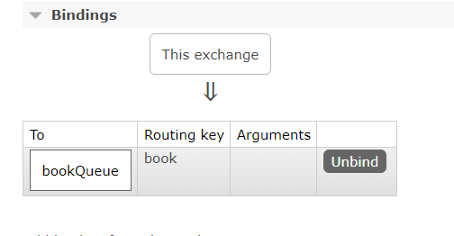
   
      