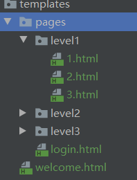
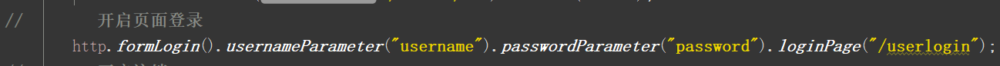
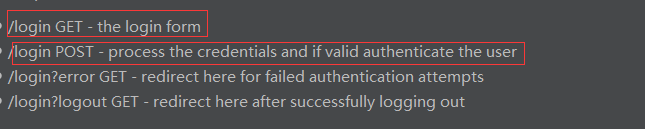
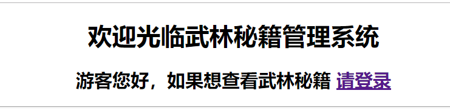
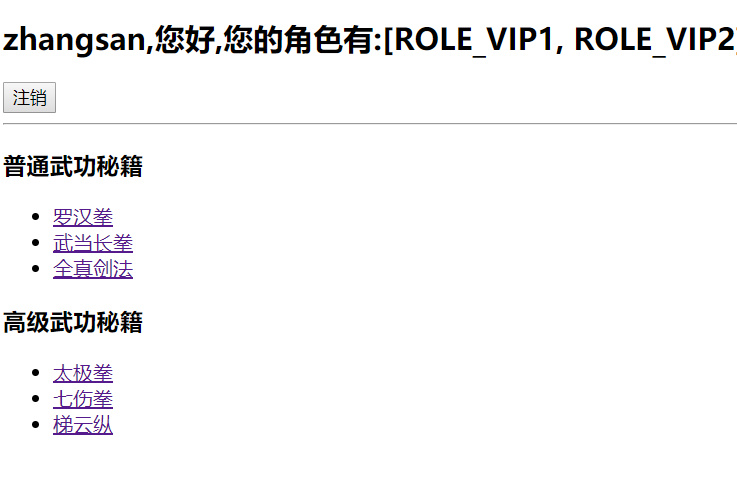
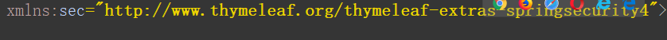
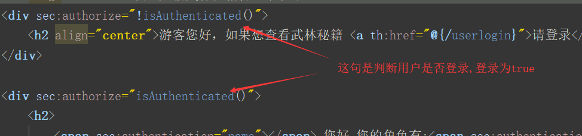
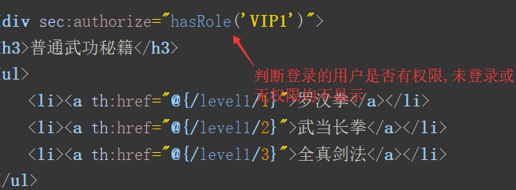
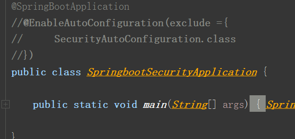

#### spring security

##### usage

1. add maven dependence

   ```pom
   	<dependency>
   			<groupId>org.springframework.boot</groupId>
   			<artifactId>spring-boot-starter-security</artifactId>
      </dependency>
   
   	为thymeleaf语法提供security支持
       <dependency>
           <groupId>org.thymeleaf.extras</groupId>
           	<artifactId>thymeleaf-extras-springsecurity4</artifactId>
           <version>3.0.4.RELEASE</version>
       </dependency>
   ```

   注意 springboot版本为2.0.8,高于2.1.x,security页面语法不支持

2. security的安全认证基于 认证与授权

   创建配置类继承`WebSecurityConfigurerAdapter`,覆盖该类的方法实现自定义配置.

    访问的目录结构:

   

   ```java
   	 配置授权规则
       @Override
       protected void configure(HttpSecurity http) throws Exception {
           为页面配置拦截规则,访问level1下的文件,登录的用户必须具备VIP1的角色...
           http.authorizeRequests().antMatchers("/").permitAll()
                   .antMatchers("/level1/**").hasRole("VIP1")
                   .antMatchers("/level2/**").hasRole("VIP2")
                   .antMatchers("/level3/**").hasRole("VIP3");
            
            
            
            开启页面登录      		     
            http.formLogin();
           
           准许注销,并注销成功且清除cookie后重定向到/
           http.logout().logoutSuccessUrl("/");
            
            开启记住我,默认用户登录后将用户登录的cookie返回,下次登录时,先查看是否携带登录信息的cookie,如果存在就免登录
           http.rememberMe().rememberMeParameter("remmber");
       }
   ```

   ```java
   配置认证规则,为了简单起见,我们在内存中配置这三个用户,一个用户可具有多个角色 
   protected void configure(AuthenticationManagerBuilder auth) throws Exception {
           auth.inMemoryAuthentication()
                   .withUser("zhangsan").password("123456").roles("VIP1", "VIP2").and()
                   .withUser("lisi").password("123456").roles("VIP1", "VIP3").and()
                   .withUser("wangwu").password("123456").roles("VIP2", "VIP3");
       }
   ```

##### customer 

1. 自定义登录页面

   需求 系统提供的登录页面ui过于简单,我们需要`自定义登录页面`

   

   上述方法表示 登录页面为`/userlogin`页面,登录时所携带的参数为`username`,`password`

   需要注意的是spring security的默认配置规则如下

   

   也就是说如果 登录页面为`Get /userlogin`,那么校验用户密码的url就是`Post /userlogin`,这样security就会使用默认的校验规则去校验用户名和密码

2. 自定义页面展示

   需求 根据不同的用户,显示不同的消息,一张页面上

   -------------

   **未登录状态:**

   

   **登录具备VIP1,VIP2的角色:**

   	

-----------------------------

实现上面的效果就需要引入hymeleaf-extras-springsecurity4依赖

1. 引入名称空间



 2. 利用thymelaf语法写入规则:

    

    


##### other

背景:在项目刚创建时,我们是不希望启用security的安全规则,这时我们有2个选择,1.`删除依赖`,2.`排除security的自动配置`

很明显 第二种要更加易用



